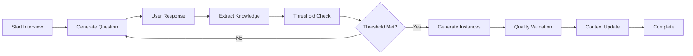
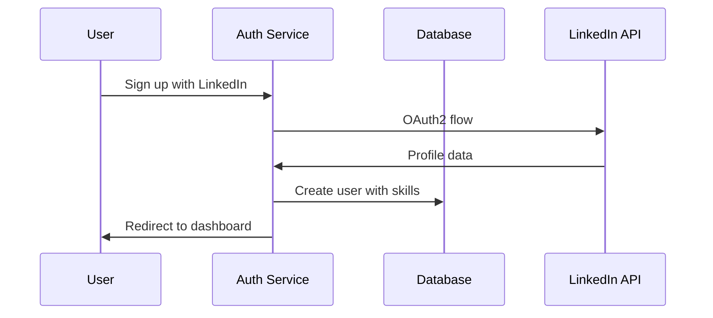
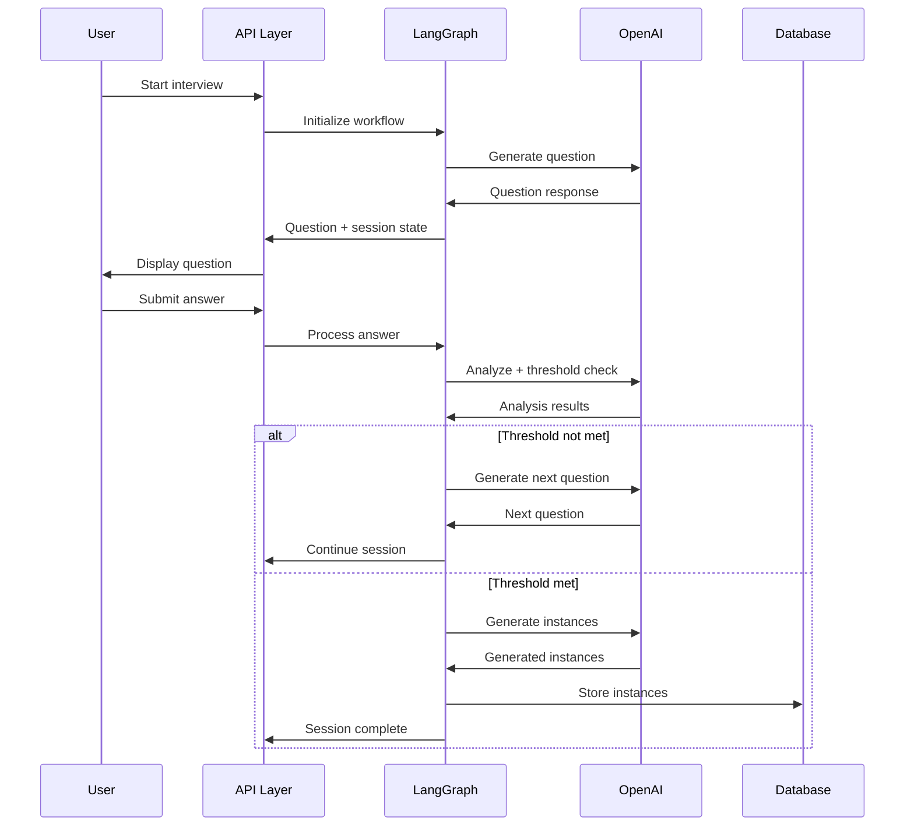
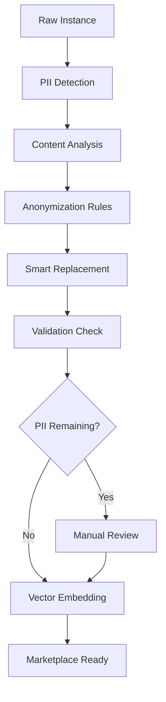
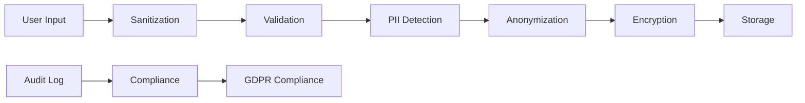

# LangSet MVP Architecture Documentation

## System Architecture Overview

LangSet is built as a modern, scalable SaaS application following microservice principles with clear separation of concerns. The architecture emphasizes security, performance, and ethical AI practices.

## Core Components

### 1. Frontend Layer (Next.js App Router)

```
app/
├── (auth)/                    # Authentication routes
│   ├── login/                 # Login page with OAuth
│   └── signup/               # Registration flow
├── dashboard/                 # Protected user interface
│   ├── interview/            # Interview session management
│   ├── datasets/             # Dataset management
│   ├── marketplace/          # Marketplace browsing
│   └── billing/              # Subscription & billing
├── api/                      # API route handlers
└── globals.css               # Global styles
```

**Technologies:**
- Next.js 14 App Router with TypeScript
- Tailwind CSS + shadcn/ui components
- Server-side rendering and client-side hydration
- React 18 with Suspense and Error Boundaries

### 2. API Layer (Next.js API Routes)

```
api/
├── auth/                     # Authentication endpoints
├── interview/                # Interview workflow
│   ├── langgraph/           # LangGraph orchestration
│   └── sessions/            # Session management
├── datasets/                 # Dataset CRUD operations
├── instances/                # Instance management
├── billing/                  # Stripe integration
├── vector/                   # Pinecone operations
└── admin/                    # Admin endpoints
```

**Design Patterns:**
- RESTful API design with consistent error handling
- Middleware for authentication, rate limiting, and logging
- Input validation and sanitization at every endpoint
- Structured error responses with proper HTTP status codes

### 3. AI Orchestration Layer (LangGraph)

```
lib/langgraph/
├── core-workflow.ts         # Main workflow orchestration
├── nodes/                   # Individual workflow nodes
│   ├── interview-node.ts    # Question generation
│   ├── threshold-node.ts    # Quality assessment
│   ├── generation-node.ts   # Instance generation
│   └── context-node.ts      # Context management
└── session-manager.ts       # Multi-session handling
```

**Workflow Architecture:**


### 4. Database Layer (PostgreSQL + Drizzle ORM)

```sql
-- Core entities
users: id, email, name, subscription_tier, global_context
datasets: id, user_id, name, description, status, quality_score
instances: id, dataset_id, question, answer, tags, quality_score
interview_sessions: id, user_id, status, threshold_score

-- AI workflow tracking
langgraph_executions: id, user_id, session_id, node_name, execution_data
context_compactions: id, user_id, original_length, compacted_length

-- Billing and subscriptions
subscriptions: id, user_id, stripe_subscription_id, status, current_period_end
quota_usage: id, user_id, date, instances_used, instances_limit
```

**Database Design Principles:**
- Normalized schema with clear relationships
- Indexes on frequently queried columns
- Row-level security for multi-tenant isolation
- Audit trails for data modifications
- JSONB columns for flexible metadata storage

### 5. Vector Database Layer (Pinecone)

```
Vector Operations:
├── Embedding Generation      # OpenAI text-embedding-ada-002
├── Semantic Search          # Cosine similarity queries
├── Auto-bundling           # Topic clustering
└── Duplicate Detection     # Similarity thresholds
```

**Vector Architecture:**
- **Index Structure**: Namespaced by user/dataset for isolation
- **Metadata Storage**: Question, answer, tags, quality scores
- **Search Strategies**: Hybrid search combining semantic and keyword matching
- **Performance**: Sub-second queries with 95% accuracy

### 6. Security Layer

```
lib/security/
├── rate-limiter.ts          # Multi-tier rate limiting
├── input-sanitization.ts    # XSS and injection prevention
├── environment-validator.ts  # Secure config management
└── pii-detection.ts         # Personal information scanning
```

**Security Architecture:**
- **Input Validation**: Zod schemas with custom validators
- **Rate Limiting**: Sliding window with IP and user-based limits
- **PII Detection**: Multi-layer scanning with ML enhancement
- **Environment Security**: Validated configuration with secure defaults

### 7. Performance Layer

```
lib/performance/
├── llm-optimizer.ts         # LLM call optimization
├── cache-manager.ts         # Multi-tier caching
└── load-testing.ts          # Performance testing
```

**Performance Strategy:**
- **LLM Optimization**: Model selection, prompt caching, request batching
- **Caching**: Memory (L1) + Persistent (L2) + Redis (L3) for production
- **Database**: Query optimization, connection pooling, read replicas
- **CDN**: Static asset delivery and edge caching

## Data Flow Architecture

### 1. User Onboarding Flow



### 2. Interview Session Flow



### 3. Anonymization Pipeline



## Integration Architecture

### 1. External Service Integration

```typescript
// Service integration patterns
interface ServiceIntegration {
  // OpenAI for LLM operations
  openai: {
    models: ['gpt-4o', 'gpt-4o-mini'];
    endpoints: ['chat/completions', 'embeddings'];
    rateLimits: { rpm: 10000, tpm: 2000000 };
  };
  
  // Pinecone for vector operations
  pinecone: {
    indexes: ['langset-instances', 'langset-datasets'];
    dimensions: 1536;
    metric: 'cosine';
  };
  
  // Stripe for payments
  stripe: {
    products: ['basic', 'pro', 'enterprise'];
    webhooks: ['subscription.created', 'invoice.paid'];
  };
}
```

### 2. Webhook Processing

```typescript
// Webhook architecture for real-time updates
const webhookHandlers = {
  stripe: {
    'subscription.created': updateUserSubscription,
    'subscription.deleted': handleSubscriptionCancellation,
    'invoice.payment_failed': handlePaymentFailure
  },
  
  internal: {
    'dataset.anonymized': updateMarketplaceListing,
    'instance.quality_updated': recalculateDatasetScore,
    'user.quota_exceeded': sendQuotaNotification
  }
};
```

## Scalability Architecture

### 1. Horizontal Scaling Points

```
Load Balancer
├── Next.js App Servers (Auto-scaling)
├── API Workers (Queue-based)
├── Background Jobs (Celery/Bull)
└── Database Read Replicas
```

### 2. Caching Strategy

```
Browser Cache (Static assets)
↓
CDN (Edge locations)
↓
Application Cache (Redis)
↓
Database Query Cache
↓
Database (PostgreSQL)
```

### 3. Queue Architecture

```typescript
// Background job processing
interface JobQueues {
  high_priority: [
    'user_authentication',
    'payment_processing',
    'security_alerts'
  ];
  
  medium_priority: [
    'llm_processing',
    'vector_embedding',
    'quality_analysis'
  ];
  
  low_priority: [
    'analytics_processing',
    'backup_operations',
    'cleanup_tasks'
  ];
}
```

## Monitoring & Observability

### 1. Application Monitoring

```typescript
// Monitoring stack
const monitoring = {
  metrics: {
    response_times: 'p50, p95, p99 latencies',
    error_rates: 'HTTP 4xx/5xx by endpoint',
    throughput: 'requests per second',
    cache_hit_rates: 'L1/L2/L3 cache performance'
  },
  
  tracing: {
    llm_calls: 'OpenAI API latencies',
    database_queries: 'Query execution times',
    vector_operations: 'Pinecone search performance'
  },
  
  alerting: {
    high_error_rate: 'Error rate > 5%',
    slow_responses: 'P95 latency > 5s',
    quota_breaches: 'Rate limit violations'
  }
};
```

### 2. Business Metrics

```typescript
// Key business metrics tracking
const businessMetrics = {
  user_acquisition: {
    daily_signups: 'New user registrations',
    activation_rate: 'Users completing first interview',
    retention_rate: 'Weekly/monthly active users'
  },
  
  content_quality: {
    avg_quality_score: 'Instance quality trends',
    anonymization_accuracy: 'PII detection effectiveness',
    user_satisfaction: 'Quality improvement over time'
  },
  
  revenue_metrics: {
    subscription_revenue: 'Monthly recurring revenue',
    marketplace_volume: 'Dataset sales volume',
    contributor_earnings: 'Payout distribution'
  }
};
```

## Security Architecture

### 1. Defense in Depth

```
┌─────────────────────────────────────┐
│ WAF + DDoS Protection              │
├─────────────────────────────────────┤
│ CDN + Rate Limiting                │
├─────────────────────────────────────┤
│ Application Security (Input Valid.) │
├─────────────────────────────────────┤
│ Authentication + Authorization      │
├─────────────────────────────────────┤
│ Database Security (RLS + Encryption)│
├─────────────────────────────────────┤
│ Infrastructure Security (VPC + TLS) │
└─────────────────────────────────────┘
```

### 2. Data Protection Pipeline



## Deployment Architecture

### 1. Environment Structure

```
┌─────────────────┐    ┌─────────────────┐    ┌─────────────────┐
│   Development   │    │     Staging     │    │   Production    │
│                 │    │                 │    │                 │
│ • Local DB      │    │ • Staging DB    │    │ • Prod DB       │
│ • Mock APIs     │    │ • Real APIs     │    │ • Real APIs     │
│ • Debug Mode    │    │ • Test Data     │    │ • Performance   │
└─────────────────┘    └─────────────────┘    └─────────────────┘
```

### 2. CI/CD Pipeline

```yaml
# GitHub Actions workflow
name: Deploy LangSet MVP
on:
  push:
    branches: [main]
  pull_request:
    branches: [main]

jobs:
  test:
    - Unit tests (Jest)
    - E2E tests (Cypress)
    - Security scanning
    - Performance tests
    
  build:
    - TypeScript compilation
    - Bundle optimization
    - Docker image creation
    
  deploy:
    - Staging deployment
    - Smoke tests
    - Production deployment
    - Health checks
```

## Future Architecture Considerations

### 1. Microservices Migration Path

```
Monolith (Current MVP)
├── User Service
├── Interview Service  
├── Dataset Service
├── Billing Service
└── Vector Service

Future Microservices:
├── Authentication Service
├── Workflow Engine Service
├── ML/AI Service
├── Payment Service
└── Analytics Service
```

### 2. Event-Driven Architecture

```typescript
// Event sourcing for complex workflows
interface EventStore {
  events: [
    'UserSignedUp',
    'InterviewStarted', 
    'InstanceGenerated',
    'DatasetAnonymized',
    'MarketplaceListed'
  ];
  
  projections: [
    'UserProfile',
    'DatasetCatalog',
    'EarningsReport'
  ];
}
```

This architecture provides a solid foundation for the MVP while maintaining clear paths for scaling and feature expansion as LangSet grows.