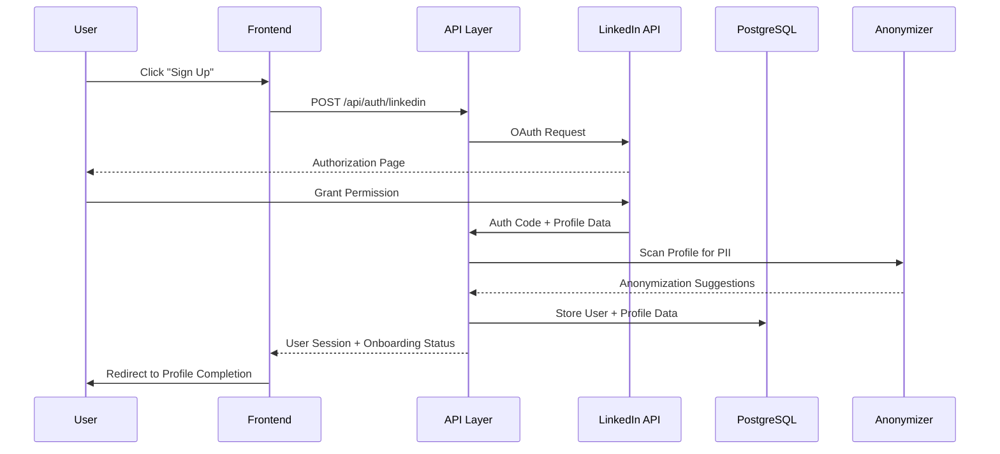
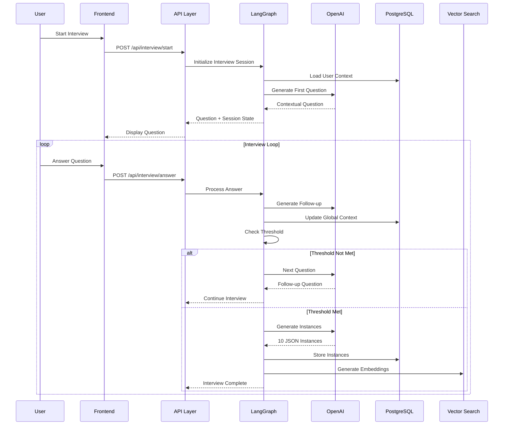
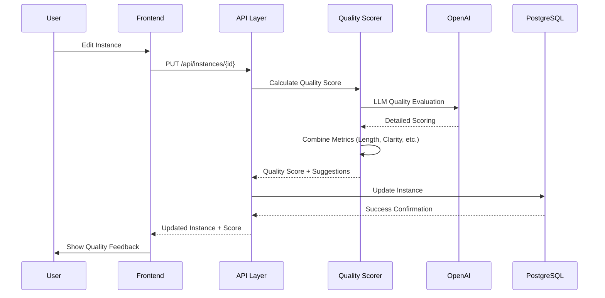
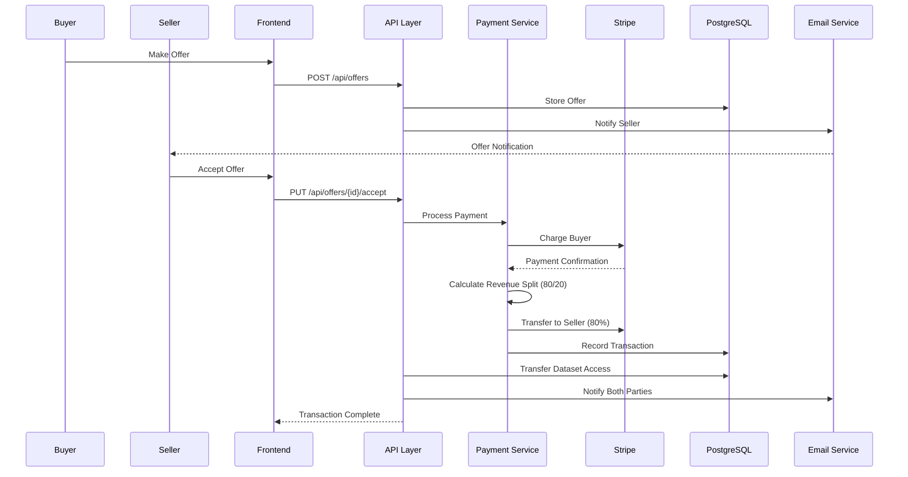
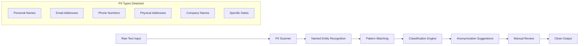
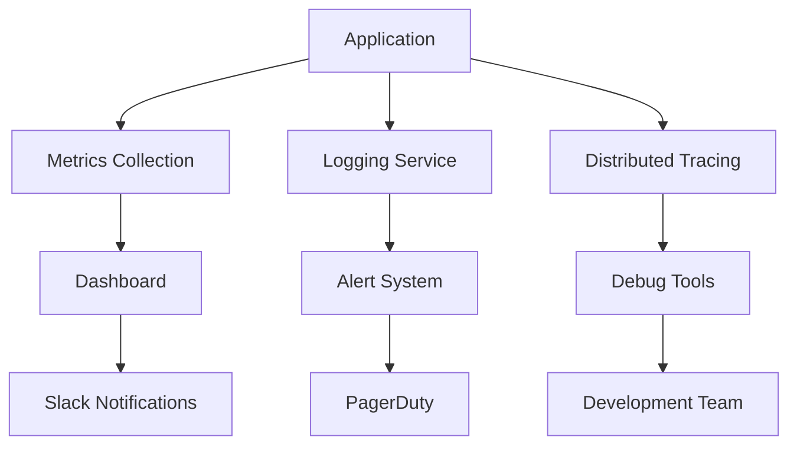

# LangSet MVP System Architecture

## Overview
This document outlines the complete system architecture for the LangSet ethical AI data marketplace MVP, including all data flows, integrations, and ethical components.

## High-Level Architecture Diagram

```mermaid
graph TB
    %% User Interface Layer
    subgraph "Frontend - Next.js 14"
        UI[React Dashboard]
        AUTH[Authentication Pages]
        INTERVIEW[Interview Interface]
        EDIT[Dataset Editor]
        MARKETPLACE[Marketplace]
        PROFILE[User Profile]
    end

    %% API Layer
    subgraph "API Layer - Next.js App Router"
        API["/api/* Routes"]
        MIDDLEWARE[Auth Middleware]
        WEBHOOKS[Webhook Handlers]
    end

    %% Core Backend Services
    subgraph "Backend Services"
        LANGGRAPH[LangGraph Orchestrator]
        QUALITY[Quality Scoring Engine]
        ANON[Anonymization Pipeline]
        PAYMENT[Payment Processor]
        SEARCH[Vector Search Service]
    end

    %% Data Storage Layer
    subgraph "Data Layer"
        POSTGRES[(PostgreSQL)]
        PINECONE[(Pinecone Vector DB)]
        BLOB[Vercel Blob Storage]
        CACHE[Redis Cache]
    end

    %% External Integrations
    subgraph "External APIs"
        LINKEDIN[LinkedIn API]
        OPENAI[OpenAI GPT-4]
        STRIPE[Stripe Connect]
        EMAIL[Email Service]
    end

    %% Data Flow Connections
    UI --> API
    AUTH --> API
    INTERVIEW --> API
    EDIT --> API
    MARKETPLACE --> API
    PROFILE --> API

    API --> MIDDLEWARE
    API --> LANGGRAPH
    API --> QUALITY
    API --> ANON
    API --> PAYMENT
    API --> SEARCH

    LANGGRAPH --> OPENAI
    LANGGRAPH --> POSTGRES
    QUALITY --> POSTGRES
    ANON --> POSTGRES
    PAYMENT --> STRIPE
    SEARCH --> PINECONE

    MIDDLEWARE --> POSTGRES
    WEBHOOKS --> POSTGRES
    WEBHOOKS --> STRIPE

    API --> LINKEDIN
    API --> EMAIL

    %% Styling
    classDef frontend fill:#00D26A,stroke:#000,color:#000
    classDef backend fill:#1A1F26,stroke:#00D26A,color:#fff
    classDef data fill:#2A3441,stroke:#00F578,color:#fff
    classDef external fill:#374151,stroke:#9CA3AF,color:#fff

    class UI,AUTH,INTERVIEW,EDIT,MARKETPLACE,PROFILE frontend
    class API,MIDDLEWARE,WEBHOOKS,LANGGRAPH,QUALITY,ANON,PAYMENT,SEARCH backend
    class POSTGRES,PINECONE,BLOB,CACHE data
    class LINKEDIN,OPENAI,STRIPE,EMAIL external
```



## Detailed Data Flow Architecture

### 1. User Onboarding Flow


### 2. Interview & Instance Generation Flow


### 3. Dataset Refinement & Quality Scoring


### 4. Marketplace & Payment Flow


## Database Schema Architecture

### Core Tables
```sql
-- Users with LinkedIn integration
users (
  id, name, email, linkedin_id, profile_complete,
  consent_tracking, ip_disclaimer_accepted,
  created_at, updated_at
)

-- Global context storage
user_contexts (
  id, user_id, context_data (JSONB),
  skills_extracted (JSONB), 
  last_compacted_at, created_at, updated_at
)

-- Interview sessions
interview_sessions (
  id, user_id, status, threshold_score,
  session_data (JSONB), completed_at,
  created_at, updated_at
)

-- Generated instances
instances (
  id, question, answer, tags (JSONB),
  quality_score, edit_count, last_edited_by,
  dataset_id, anonymization_status,
  created_at, updated_at
)

-- Datasets
datasets (
  id, name, description, user_id,
  instance_count, average_quality_score,
  anonymization_complete, created_at, updated_at
)

-- Marketplace listings
listings (
  id, title, description, price, currency,
  is_active, is_bundle, bundle_datasets (JSONB),
  shareable_link, views, seller_id, dataset_id,
  created_at, updated_at
)

-- Offers and transactions
offers (
  id, amount, currency, message, status,
  expires_at, buyer_id, listing_id,
  created_at, updated_at
)

transactions (
  id, offer_id, total_amount, platform_fee,
  seller_amount, stripe_payment_intent_id,
  status, completed_at, created_at, updated_at
)

-- Revenue tracking
revenue_distributions (
  id, transaction_id, recipient_id, amount,
  percentage, type (platform|seller),
  stripe_transfer_id, created_at
)
```

### Vector Storage (Pinecone)
```javascript
// Vector schema for semantic search
{
  id: "instance_uuid",
  values: [0.1, 0.2, ...], // 1536-dim embedding
  metadata: {
    dataset_id: "uuid",
    quality_score: 85,
    tags: ["react", "hooks"],
    created_at: "2024-01-01",
    user_id: "uuid"
  }
}
```

## Security & Privacy Architecture

### Anonymization Pipeline


### Ethical Safeguards
1. **No Post-Purchase Revocation**: Blockchain-like immutability for completed transactions
2. **Consent Tracking**: Every data point linked to explicit consent
3. **Anonymization Verification**: Manual review for high-sensitivity data
4. **Quality Thresholds**: Minimum 60% quality score for marketplace listing

## Technical Implementation Details

### LangGraph Workflow Architecture
```javascript
// Interview workflow definition
const interviewWorkflow = {
  nodes: {
    interview: InterviewNode,
    threshold_check: ThresholdCheckNode,
    generate_instances: GenerateInstancesNode,
    update_context: UpdateContextNode,
    quality_check: QualityCheckNode
  },
  edges: {
    interview: ["threshold_check"],
    threshold_check: {
      continue: ["interview"],
      complete: ["generate_instances"]
    },
    generate_instances: ["quality_check"],
    quality_check: ["update_context"],
    update_context: ["END"]
  }
}
```

### API Route Architecture
```
/api/
├── auth/
│   ├── linkedin/           # OAuth flow
│   └── session/           # Session management
├── interview/
│   ├── start/             # Initialize session
│   ├── answer/            # Process responses
│   └── complete/          # Finalize and generate
├── instances/
│   ├── [id]/              # CRUD operations
│   └── quality-score/     # Quality evaluation
├── datasets/
│   ├── create/            # Dataset creation
│   └── [id]/             # Dataset management
├── marketplace/
│   ├── listings/          # Marketplace CRUD
│   ├── search/            # Vector search
│   └── offers/            # Offer management
├── payments/
│   ├── process/           # Payment handling
│   └── webhooks/          # Stripe webhooks
└── admin/
    ├── analytics/         # Platform metrics
    └── moderation/        # Content review
```

### Performance Optimization Strategy
1. **Caching Layers**:
   - Redis for session data
   - Next.js static generation for marketplace
   - CDN for user-generated content

2. **Database Optimization**:
   - Indexes on frequently queried fields
   - Partitioning for large tables
   - Connection pooling

3. **Vector Search Optimization**:
   - Batch embedding generation
   - Approximate nearest neighbor search
   - Metadata filtering pre-processing

### Monitoring & Observability


## Scalability Considerations

### Horizontal Scaling Strategy
- **Frontend**: Vercel Edge Functions for global distribution
- **API**: Stateless design for easy horizontal scaling
- **Database**: Read replicas for query optimization
- **Vector DB**: Pinecone auto-scaling with usage-based pricing

### Performance Targets
- **API Response Time**: <200ms average
- **Database Queries**: <100ms average  
- **Vector Search**: <500ms for similarity queries
- **Payment Processing**: <3s end-to-end
- **Page Load Time**: <2s for dashboard pages

This architecture provides a robust foundation for the LangSet MVP while maintaining ethical standards and scalability for future growth.